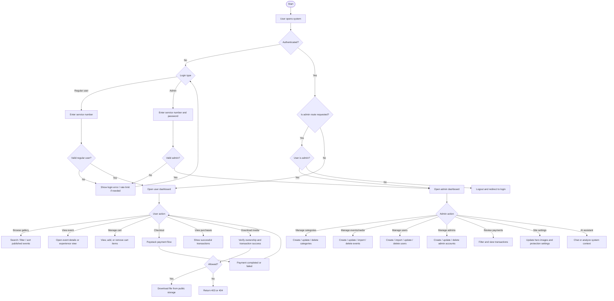
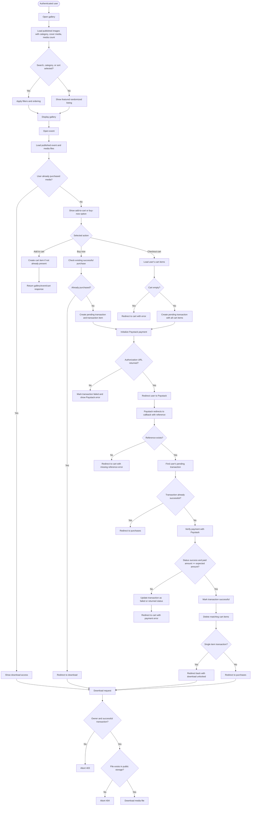
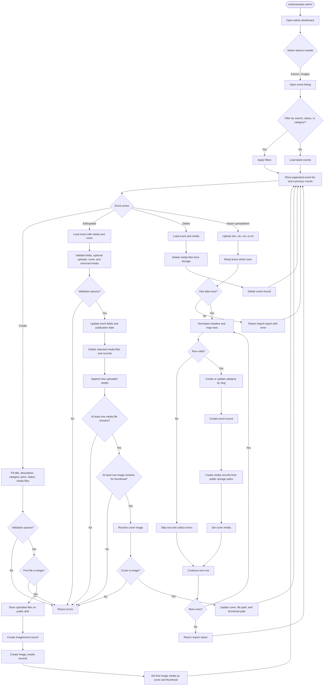
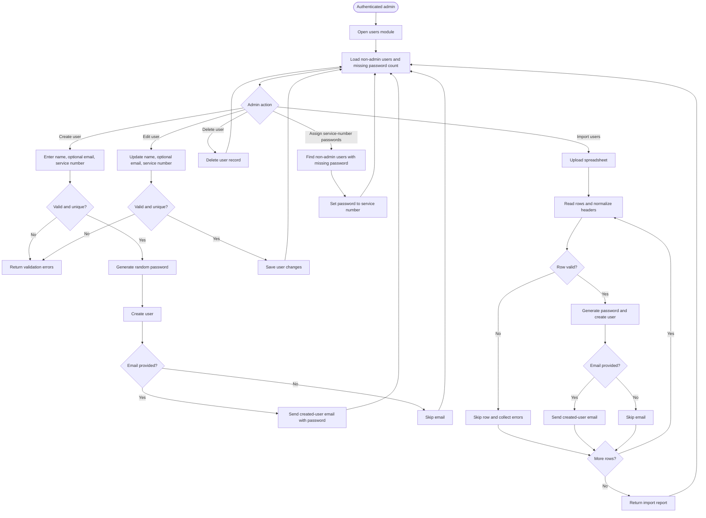
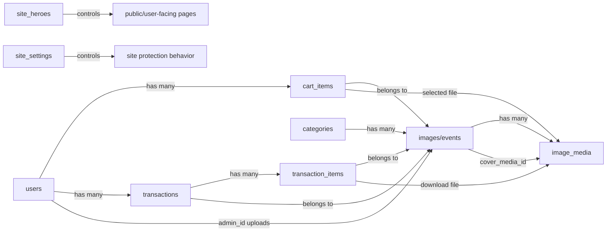

# GAF Album System Logic Flowchart

This document summarizes the main logic flows in the Laravel-based GAF Album system.

## 1. Overall System Flow

## 2. User Gallery, Cart, Payment, and Download Flow

## 3. Admin Event and Media Management Flow

## 4. Admin User Management Flow

## 5. Main Data Relationship Flow

## 6. High-Level Modules

- Authentication: regular users log in with service number; admins log in with service number and password.
- User gallery: authenticated users browse only published events.
- Cart: users add individual media items and checkout one or more items.
- Payment: Paystack is initialized from a pending local transaction, then verified on callback.
- Purchases: only successful transactions unlock media downloads.
- Admin dashboard: admins manage categories, events/media, users, admins, payments, hero images, site protection, and AI assistance.
- Storage: uploaded event files are stored on Laravel's public disk and downloaded only after ownership and payment checks.
